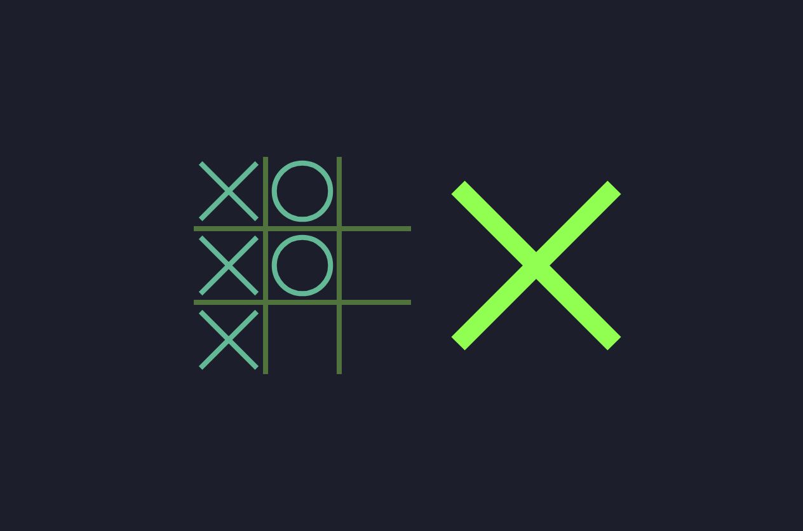

# tictactoe

This is a tic-tac-toe game created using HTML, CSS, and JavaScript.
It's a fun project.
I'm learning CSS, especially animations, positioning, flexbox, SVG, etc.

It has cool animations.
